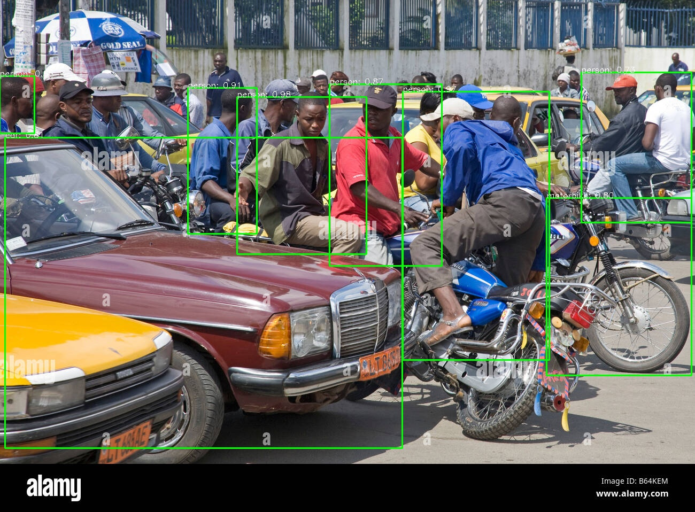

This project demonstrates object detection using GPU acceleration with OpenCV and CUDA.

## Prerequisites

- [Docker]:https://docs.docker.com/desktop installed on your system.
- [CUDA Toolkit]:https://developer.nvidia.com/cuda-downloads installed to enable GPU support.

## Running the Solution

### 1. Clone this Repository

Clone the repository to your local machine:

```bash
git clone https://github.com/guyraymond/gpu-object-detection.git
```

```bash
cd gpu-object-detection
```

Place your image in images/input.jpg.

### 1.1 On Linux Bash

Build the Docker image

```bash
docker build -t gpu-object-detection .
```

Run the Docker container

```bash
docker run --gpus all -v $(pwd)/images:/workspace/images -it gpu-object-detection
```

### 1.2 On Windows PowerShell

Build the Docker image

```bash
docker build -t gpu-object-detection .
```

Run the Docker container

```bash
docker run --gpus all -v ${PWD}/images:/workspace/images -it gpu-object-detection
```

### Sample Output

Input Image:


Output Image:

